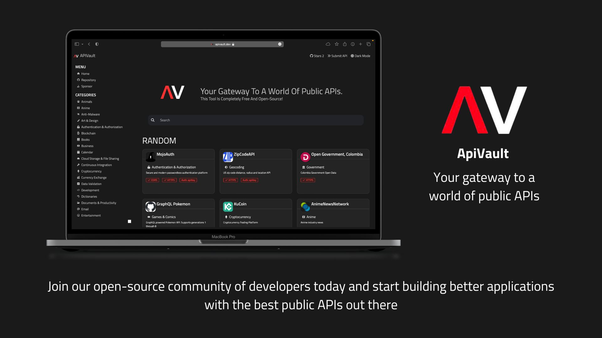

<h1 align="center">
  <br>
   APIVault 🛡️
  <br>
</h1>



<p align="center">
  <a href="#how-to-use">How To Use</a> •
  <a href="#credits">Credits</a> •
  <a href="#support">Support</a> •
  <a href="#license">License</a>
</p>

<h1 align="center">
  <a href="https://github.com/Exifly/ApiVault/issues/new?assignees=&labels=add+api&template=add-your-api.md&title=%5BAPIFT%5D">Click here to submit your API</a>
</h1>


## How To Use 

### Frontend
To clone and run this application in developer mode, you'll need [Git](https://git-scm.com) and [npm](http://npmjs.com) installed on your computer. From your command line:

```bash
# Clone this repository
$ git clone https://github.com/exifly/ApiVault

# Go into the repository
$ cd ApiVault/frontend

# Install dependencies
$ npm install

# Run the app
$ npm run dev
```

## Set .env file
Inside /frontend
```bash
cat .env.sample > .env
```

### Backend
To clone and run this application in developer mode, you'll need [docker](https://www.docker.com/) installed on your computer. From your command line:

```bash
# Clone this repository
$ git clone https://github.com/exifly/ApiVault

# Go into the repository
$ cd ApiVault/backend

# Run docker-compose
$ docker-compose up

```

## Credits 

This software uses the following open source packages:
 
### Frameworks 🛠️
- [](http://electron.atom.io/)
- [](https://flask.palletsprojects.com/en/2.2.x/)

### Tools 🔧
- [VueRouter](https://router.vuejs.org/)
- [GSAP](https://greensock.com/gsap/)

## Contributing 

If you've ever wanted to contribute to open source, and a great cause, now is your chance!

> When contributing to this repository, please first discuss the change you wish to make via issues with the authors of this repository before making a change. <br>
> Make sure to go through the **[CODE OF CONDUCT](https://github.com/Exifly/ApiVault/blob/main/CODE_OF_CONDUCT.md)** once before making changes!

### How to Contribute 🤔

- Look at the existing [**Issues**](https://github.com/Exifly/ApiVault/issues) or [**create a new issue**](https://github.com/Exifly/ApiVault/issues/new/choose)!
- [**Fork the Repo**](https://github.com/Exifly/ApiVault/fork) to make changes. 
- Then, create a branch for any issue that you are working on. 
- Finally, implement your changes by committing your work.
- Create a **[Pull Request](https://github.com/Exifly/ApiVault/compare)** (_PR_), which will be promptly reviewed and given suggestions for improvements by the community.
- Add screenshots or screen captures to your Pull Request to help us understand the effects of the changes proposed in your PR.

> For more detailed instructions ---> **[CONTRIBUTING.md](https://github.com/Exifly/ApiVault/blob/main/CONTRIBUTING.md)**

## Contributors ✨

Thanks go to these wonderful people ✨:

<!-- ALL-CONTRIBUTORS-LIST:START - Do not remove or modify this section -->
<!-- prettier-ignore-start -->
<!-- markdownlint-disable -->
<table>
  <tbody>
    <tr>
      <td align="center"><a href="https://github.com/gdjohn4s"><br /><sub><b>gdjohn4s</b></sub></a><br />🥳</td>
      <td align="center"><a href="https://github.com/FlavioAdamo"><br /><sub><b>Flavio Adamo</b></sub></a><br />🥳</td>
      <td align="center"><a href="https://github.com/NirajD10"><br /><sub><b>NirajD10</b></sub></a><br />🥳</td>
      <td align="center"><a href="https://github.com/kiabq"><br /><sub><b>kiabq</b></sub></a><br />🥳</td>
      <td align="center"><a href="https://github.com/the-amazing-atharva"><br /><sub><b>Atharva Salitri</b></sub></a><br />🥳</td>
      <td align="center"><a href="https://github.com/caickPassarella"><br /><sub><b>Caick</b></sub></a><br />🥳</td>
      <td align="center"><a href="https://github.com/kotkaravishkar"><br /><sub><b>Avishkar Kotkar
</b></sub></a><br />🥳</td>
      <td align="center"><a href="https://github.com/iamjamesfrancis"><br /><sub><b>James Francis
</b></sub></a><br />🥳</td>
    </tr>
  </tbody>
</table>

## Support 

We would love to have you, feel free to open issues and pull requests and **Don't forget to leave a star ⭐**

<a href="https://www.buymeacoffee.com/exifly" target="_blank"></a>

## License 
ApiVault is licensed under the terms of **MIT License**. Check out [LICENSE](https://github.com/Exifly/ApiVault/blob/main/LICENSE) for details.

<br>

> [exifly.it](https://exifly.it) &nbsp;&middot;&nbsp;
> GitHub [@exifly](https://github.com/Exifly) &nbsp;
