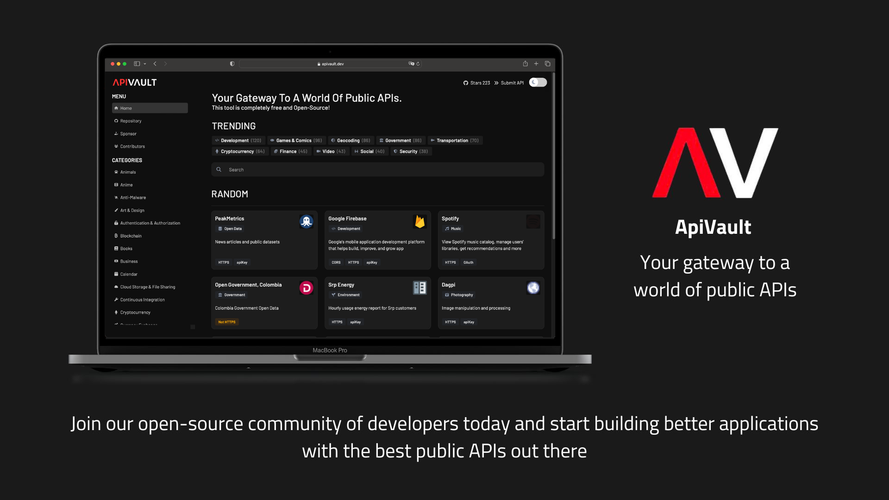

<h1 align="center">
  <br>
   APIVault v2.x 🛡️ Beta 1
  <br>
</h1>



<p align="center">
    <a href="https://github.com/Exifly/ApiVault/tree/main" alt="Stable">
        </a>
    <a href="https://github.com/Exifly/ApiVault/tree/beta_v2.0.0-b1" alt="Beta">
        </a>
    <a href="https://github.com/exifly/apivault/graphs/contributors" alt="Contributors">
        </a>
    <a href="https://github.com/exifly/apivault/pulse" alt="Activity">
        </a>
    <a href="https://github.com/exifly/apivault/graphs/contributors" alt="Contributors">
        </a>
    <a href="https://discord.gg/ShqYJynSnq" alt="Discord server">
        </a>
</p>
<p align="center">
  <a href="#how-to-use">How To Use</a> •
  <a href="#credits">Credits</a> •
  <a href="#support">Support</a> •
  <a href="#license">License</a>
</p>

<h1 align="center">
  <a href="https://github.com/Exifly/ApiVault/issues/new?assignees=&labels=add+api&template=add-your-api.md&title=%5BAPIFT%5D">Click here to submit your API</a>
</h1>

<div align="center">

  # Finally with
  <a href="">
  
  </a>
  <a href="">
    
  </a>
  <a href="">
    
  </a>


</div>

<hr />

# Disclaimer
### UNDER ACTIVE DEVELOPMENT
This is the beta version using typescript and Nuxt.js! Please report any issues you found!! Thanks.

<!-- TABLE OF CONTENTS -->
# Table of contents
<ol>
  <li>
    <a href="#prerequisites">Prerequisites</a>
  </li>
  <li>
    <a href="#how-to-use">How to use (NEW) ⚠️</a>
    <ul>
      <li><a href="#built-with">Set .env file</a></li>
      <li><a href="#how-to-use">Client/Server side using Docker</a></li>
      <li><a href="#how-to-use">Set server hostname</a></li>
    </ul>
  </li>
  <li>
    <a href="#how-to-use">How to use (OLD)</a>
    <ul>
      <li><a href="#prerequisites">Frontend</a></li>
      <li><a href="#installation">Backend</a></li>
    </ul>
  </li>
  <li>
    <a href="#credits">Credits</a>
  </li>
  <li>
    <a href="#contributing">Contributing</a>
    <ul>
      <li><a href="#how-to-contribute">How to contribute</a></li>
      <li><a href="#contributors">Wonderful people</a></li>
    </ul>
  </li>
  <li><a href="#license">License</a></li>
  <li><a href="#support">Support</a></li>
</ol>
<hr />

## Prerequisites
Before start using the software make sure you have:
- Node > 16.x
- npm > 8.x
- yarn >= 1.x
- docker

## How To Use (New Version)

## Set .env file
Inside root repository folder rename .env.dev file
```bash
cat .env.dev > .env
```

Inside /frontend folder rename .env.sample file
```bash
cat .env.sample > .env
```
### Client/Server side using Docker [ ⚠️ : it may be broken ]
To run everything using docker you need to be in repo root path and run those commands:

```bash
# Clone this repository
$ git clone https://github.com/exifly/ApiVault

# Go into the repository
$ cd ApiVault

# Install dependencies
$ docker-compose up
```

This docker configuration will prepare Server/Client side on the same stack using the same docker network.
### Stack screenshot


It's little bit broken, some errors can appear on your screen blocking the execution, you can found the old **How to** version below this chapter.

**Note**:

Please open an [Issue](https://github.com/Exifly/ApiVault/issues/new?assignees=&labels=&projects=&template=bug_report.md&title=) if you see docker errors! (You can try fix on your own if you want)

Now just go on **localhost:8080** from your browser.

### Set server hostname
You probably got a `CONNECTION REFUSED 127.0.0.1:9001` on the frontend. That's because your local environment doesn't know how to resolve `server` hostname (only on Nuxt.js client side).

For now to solve this (as temp workaround), you need to add this entry below your localhost configuration in your **hosts** file.
```bash
127.0.0.1     localhost
127.0.0.1     server
```

**hosts** file location:
- on Mac/Linux: `/etc/hosts`
- on Windows: `C:\Windows\system32\drivers\etc`


### Done
<hr />

## How To Use (Old Version)
### Frontend
To clone and run this application in developer mode, you'll need [Git](https://git-scm.com) and [yarn](https://yarnpkg.com/) installed on your computer. You can use [npm](https://www.npmjs.com/) if you want.
From your command line:

```bash
# Clone this repository
$ git clone https://github.com/exifly/ApiVault

# Go into the repository
$ cd ApiVault/frontend

# Install dependencies
$ yarn install

# Run the app
$ yarn dev
```

## Set .env file
Inside /frontend folder
```bash
cat .env.sample > .env
```

### Backend
To clone and run this application in developer mode, you'll need [docker](https://www.docker.com/) installed on your computer. From your command line:

```bash
# Clone this repository
$ git clone https://github.com/exifly/ApiVault

# Go into the repository
$ cd ApiVault/backend

# Run docker-compose
$ docker-compose up

```

<hr />

# Credits 

This software uses the following open source packages:
 
### Frameworks 🛠️
- [](http://electron.atom.io/)
- [](http://electron.atom.io/)
- [](https://flask.palletsprojects.com/en/2.2.x/)

### Tools 🔧
- [GSAP](https://greensock.com/gsap/)
- [public-apis](https://github.com/public-apis/public-apis) (a portion of our data)

<hr />

# Contributing 

If you've ever wanted to contribute to open source, and a great cause, now is your chance!

> When contributing to this repository, please first discuss the change you wish to make via issues with the authors of this repository before making a change. <br>
> Make sure to go through the **[CODE OF CONDUCT](https://github.com/Exifly/ApiVault/blob/main/CODE_OF_CONDUCT.md)** once before making changes!

### How to Contribute 🤔

- Look at the existing [**Issues**](https://github.com/Exifly/ApiVault/issues) or [**create a new issue**](https://github.com/Exifly/ApiVault/issues/new/choose)!
- [**Fork the Repo**](https://github.com/Exifly/ApiVault/fork) to make changes. 
- Then, create a branch for any issue that you are working on. 
- Finally, implement your changes by committing your work.
- Create a **[Pull Request](https://github.com/Exifly/ApiVault/compare)** (_PR_), which will be promptly reviewed and given suggestions for improvements by the community.
- Add screenshots or screen captures to your Pull Request to help us understand the effects of the changes proposed in your PR.

> For more detailed instructions ---> **[CONTRIBUTING.md](https://github.com/Exifly/ApiVault/blob/main/CONTRIBUTING.md)**

## Contributors ✨

Thanks go to these wonderful people ✨:

<!-- ALL-CONTRIBUTORS-LIST:START - Do not remove or modify this section -->
<!-- prettier-ignore-start -->
<!-- markdownlint-disable -->
<table>
  <tbody>
    <tr>
      <td align="center"><a href="https://github.com/gdjohn4s"><br /><sub><b>gdjohn4s</b></sub></a><br />🥳</td>
      <td align="center"><a href="https://github.com/FlavioAdamo"><br /><sub><b>Flavio Adamo</b></sub></a><br />🥳</td>
      <td align="center"><a href="https://github.com/NirajD10"><br /><sub><b>NirajD10</b></sub></a><br />🥳</td>
      <td align="center"><a href="https://github.com/kiabq"><br /><sub><b>kiabq</b></sub></a><br />🥳</td>
      <td align="center"><a href="https://github.com/the-amazing-atharva"><br /><sub><b>Atharva Salitri</b></sub></a><br />🥳</td>
      <td align="center"><a href="https://github.com/caickPassarella"><br /><sub><b>Caick</b></sub></a><br />🥳</td>
      <td align="center"><a href="https://github.com/kotkaravishkar"><br /><sub><b>Avishkar Kotkar
</b></sub></a><br />🥳</td>
      <td align="center"><a href="https://github.com/iamjamesfrancis"><br /><sub><b>James Francis
</b></sub></a><br />🥳</td>
      <td align="center"><a href="https://github.com/MOHDNEHALKHAN"><br /><sub><b>MOHD NEHAL
</b></sub></a><br />🥳</td>
      <td align="center"><a href="https://github.com/tarunsamanta2k20"><br /><sub><b>Tarun Samanta
</b></sub></a><br />🥳</td>
    </tr>
    <tr>
       <td align="center"><a href="https://github.com/realrohitgurav"><br /><sub><b>Rohit Gurav
</b></sub></a><br />🥳</td>
       <td align="center"><a href="https://github.com/Badrnyali"><br /><sub><b>Badrnyali
         </b></sub></a><br />🥳</td>
        <td align="center"><a href="https://github.com/gianmazzoran"><br /><sub><b>bytemore
      </b></sub></a><br />🥳</td>
        <td align="center"><a href="https://github.com/HassanTanveer"><br /><sub><b>Hassan Tanveer
      </b></sub></a><br />🥳</td>
        <td align="center"><a href="https://github.com/cyberGHostJs"><br /><sub><b>cyberGHostJs
      </b></sub></a><br />🥳</td>
        <td align="center"><a href="https://github.com/et-c"><br /><sub><b>et-c
      </b></sub></a><br />🥳</td>
        <td align="center"><a href="https://github.com/DomeT99"><br /><sub><b>Domenico Tenace
      </b></sub></a><br />🥳</td>
    </tr>
  </tbody>
</table>

## Support 

We would love to have you, feel free to open issues and pull requests and **Don't forget to leave a star ⭐**

<a href="https://www.buymeacoffee.com/exifly" target="_blank"></a>

## License 
ApiVault is licensed under the terms of **MIT License**. Check out [LICENSE](https://github.com/Exifly/ApiVault/blob/main/LICENSE) for details.

<br>

> [exifly.it](https://exifly.it) &nbsp;&middot;&nbsp;
> GitHub [@exifly](https://github.com/Exifly) &nbsp;
